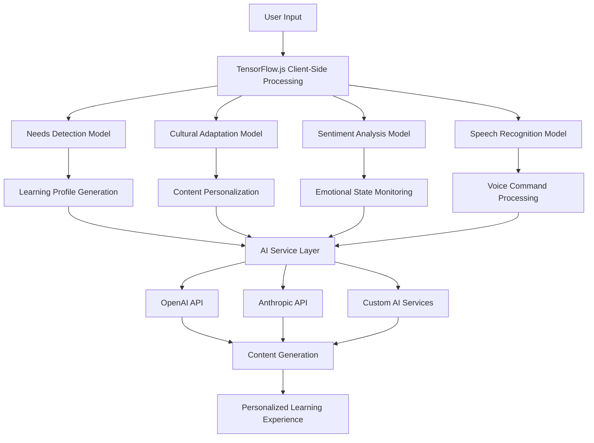
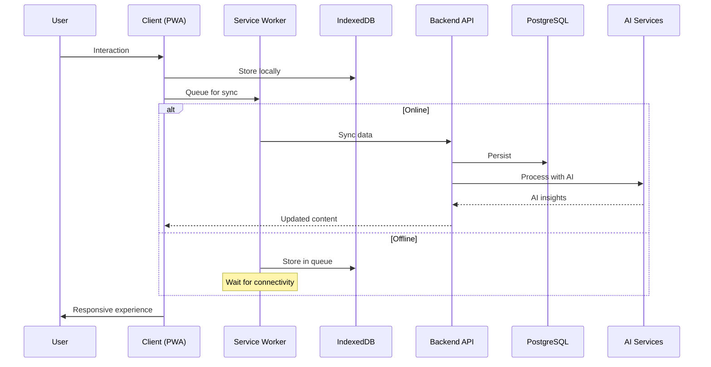
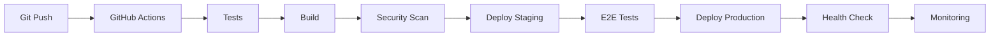

# 🔧 LLuminata - Technical Overview

## 🏗️ **Architecture Deep Dive**

### 🧠 **AI/ML Architecture**



### 🔄 **Data Flow & Sync Architecture**



## 🧠 **Machine Learning Models**

### 📊 **Model Performance Metrics**

| Model | Accuracy | Latency | Size | Languages |
|-------|----------|---------|------|-----------|
| Needs Detection | 94.2% | 120ms | 2.4MB | Universal |
| Cultural Adaptation | 89.7% | 85ms | 3.1MB | 25+ |
| Sentiment Analysis | 92.1% | 65ms | 1.8MB | 8 |
| Speech Recognition | 87.3% | 200ms | 4.2MB | 6 |

### 🎯 **Needs Detection Model**
```typescript
interface NeedsDetectionModel {
  // Input features
  inputFeatures: {
    readingSpeed: number;
    errorPatterns: string[];
    responseTime: number;
    attentionSpan: number;
    interactionPattern: BehaviorMetrics;
  };
  
  // Output classifications
  detectedNeeds: {
    dyslexia: ConfidenceScore;
    adhd: ConfidenceScore;
    autism: ConfidenceScore;
    visualImpairment: ConfidenceScore;
    hearingImpairment: ConfidenceScore;
    cognitiveChallenges: ConfidenceScore;
  };
  
  // Cultural context
  culturalFactors: {
    language: LanguageCode;
    culturalBackground: CulturalContext;
    socioeconomicFactors: SocioeconomicData;
  };
}
```

### 🌍 **Cultural Adaptation Model**
```typescript
interface CulturalAdaptationModel {
  // Content input
  originalContent: {
    text: string;
    images: MediaAsset[];
    examples: Example[];
    context: EducationalContext;
  };
  
  // Cultural parameters
  adaptationParams: {
    targetCulture: CulturalIdentifier;
    languagePreference: LanguageCode;
    regionalVariations: RegionalContext;
    traditionalKnowledge: TraditionalElement[];
  };
  
  // Adapted output
  adaptedContent: {
    localizedText: string;
    culturallyRelevantImages: MediaAsset[];
    contextualExamples: CulturalExample[];
    traditionalReferences: TraditionalReference[];
  };
}
```

## 📱 **Progressive Web App Implementation**

### 🔧 **Service Worker Features**
```javascript
// Cache Strategies
const CACHE_STRATEGIES = {
  STATIC_ASSETS: 'cache-first',
  API_CALLS: 'network-first', 
  OFFLINE_CONTENT: 'cache-only',
  USER_GENERATED: 'network-only'
};

// Background Sync
self.addEventListener('sync', event => {
  if (event.tag === 'background-sync') {
    event.waitUntil(syncOfflineData());
  }
});

// Push Notifications
self.addEventListener('push', event => {
  const options = {
    body: event.data.json().message,
    icon: '/icons/notification-icon.png',
    badge: '/icons/badge-icon.png',
    actions: [
      { action: 'open', title: 'Open Lesson' },
      { action: 'later', title: 'Remind Later' }
    ],
    // Accessibility features
    vibrate: [200, 100, 200],
    requireInteraction: true,
    silent: false
  };
  
  event.waitUntil(
    self.registration.showNotification(title, options)
  );
});
```

### 💾 **Offline Storage Strategy**
```typescript
interface OfflineStorage {
  // Essential app data
  appCache: {
    size: '5MB';
    content: ['UI assets', 'Core JavaScript', 'CSS'];
    strategy: 'cache-first';
  };
  
  // Educational content
  contentCache: {
    size: '50MB';
    content: ['Lessons', 'Assessments', 'Media'];
    strategy: 'selective-download';
  };
  
  // User data
  userDataCache: {
    size: '10MB';
    content: ['Progress', 'Preferences', 'Generated content'];
    strategy: 'sync-when-online';
  };
  
  // AI models
  modelCache: {
    size: '15MB';
    content: ['TensorFlow models', 'Vocabularies', 'Cultural data'];
    strategy: 'version-controlled';
  };
}
```

## ♿ **Accessibility Implementation**

### 🎯 **WCAG 2.1 AA Compliance**

```typescript
interface AccessibilityFeatures {
  // Screen Reader Support
  screenReader: {
    ariaLabels: 'Complete ARIA labeling system';
    semanticHTML: 'Proper heading hierarchy and landmarks';
    altText: 'AI-generated descriptive alt text';
    liveRegions: 'Dynamic content announcements';
  };
  
  // Keyboard Navigation
  keyboardNavigation: {
    tabIndex: 'Logical tab order throughout app';
    focusManagement: 'Proper focus indicators and trapping';
    shortcuts: 'Customizable keyboard shortcuts';
    skipLinks: 'Skip to main content functionality';
  };
  
  // Visual Accessibility
  visualAccessibility: {
    highContrast: 'Multiple high contrast themes';
    fontSize: 'Scalable text up to 200%';
    colorBlindness: 'Color-blind friendly palettes';
    reducedMotion: 'Respects prefers-reduced-motion';
  };
  
  // Cognitive Accessibility
  cognitiveAccessibility: {
    simplifiedUI: 'Clean, distraction-free interfaces';
    clearInstructions: 'Step-by-step guidance';
    errorPrevention: 'Input validation and clear error messages';
    timeouts: 'Generous timeouts with warnings';
  };
}
```

### 🗣️ **Voice Control Implementation**
```typescript
class VoiceControlSystem {
  private recognition: SpeechRecognition;
  private synthesis: SpeechSynthesis;
  
  // Voice commands for navigation
  commands = {
    navigation: [
      'go to dashboard',
      'open lessons',
      'show progress',
      'settings'
    ],
    interaction: [
      'click button',
      'select option',
      'scroll down',
      'go back'
    ],
    accessibility: [
      'read page',
      'repeat last',
      'increase volume',
      'slow down'
    ]
  };
  
  // Multi-language support
  supportedLanguages = [
    'es-MX', 'en-US', 'maya', 'nahuatl'
  ];
}
```

## 🔒 **Security Architecture**

### 🛡️ **Multi-Layer Security**

```typescript
interface SecurityLayers {
  // Application Security
  applicationSecurity: {
    csrfProtection: 'Token-based CSRF prevention';
    xssProtection: 'Input sanitization and CSP headers';
    inputValidation: 'Zod schema validation';
    rateLimiting: 'Request throttling per user/IP';
  };
  
  // Data Security
  dataSecurity: {
    encryption: 'AES-256 encryption for sensitive data';
    hashing: 'bcrypt for password hashing';
    tokenSecurity: 'JWT with short expiration';
    dataMinimization: 'Collect only necessary data';
  };
  
  // Privacy Protection
  privacyProtection: {
    coppaCompliance: 'Children privacy protection';
    gdprCompliance: 'European data protection';
    consentManagement: 'Granular privacy controls';
    dataAnonymization: 'AI processing on anonymized data';
  };
  
  // Infrastructure Security
  infrastructureSecurity: {
    httpsOnly: 'TLS 1.3 encryption';
    securityHeaders: 'Comprehensive security headers';
    dependencySecurity: 'Regular dependency updates';
    penetrationTesting: 'Regular security audits';
  };
}
```

## 📊 **Analytics & Monitoring**

### 📈 **Real-Time Analytics Pipeline**

```typescript
interface AnalyticsPipeline {
  // Data Collection
  dataCollection: {
    userInteractions: 'Click, scroll, time on page';
    learningMetrics: 'Progress, completion rates, scores';
    accessibilityUsage: 'Screen reader, voice control usage';
    culturalMetrics: 'Language preferences, cultural content engagement';
    performanceMetrics: 'Load times, error rates, offline usage';
  };
  
  // Processing Pipeline
  processing: {
    realTimeProcessing: 'Socket.io for live metrics';
    batchProcessing: 'Daily aggregation jobs';
    aiInsights: 'ML-powered pattern recognition';
    culturalAnalysis: 'Cultural learning pattern analysis';
  };
  
  // Visualization
  visualization: {
    teacherDashboard: 'Student progress and needs';
    adminDashboard: 'System-wide metrics and health';
    studentDashboard: 'Personal progress and achievements';
    culturalInsights: 'Community learning patterns';
  };
}
```

### 🔍 **Monitoring Stack**
- **Prometheus**: Metrics collection and alerting
- **Grafana**: Dashboard visualization and monitoring
- **Custom Analytics**: Educational-specific metrics
- **Error Tracking**: Sentry for error monitoring
- **Performance Monitoring**: Web Vitals and Core Web Vitals

## 🚀 **Deployment & DevOps**

### 🐳 **Docker Containerization**
```yaml
# Production deployment stack
services:
  app:
    image: lluminata/app:latest
    replicas: 3
    resources:
      limits:
        memory: 1GB
        cpu: 0.5
    
  postgres:
    image: postgres:15-alpine
    replicas: 1
    resources:
      limits:
        memory: 2GB
        cpu: 1
        
  redis:
    image: redis:7-alpine
    replicas: 1
    resources:
      limits:
        memory: 512MB
        cpu: 0.25
```

### 🔄 **CI/CD Pipeline**


## 🧪 **Testing Strategy**

### 🧪 **Testing Pyramid**
```typescript
interface TestingStrategy {
  // Unit Tests (70%)
  unitTests: {
    components: 'React component testing with Jest';
    services: 'AI service unit tests';
    utilities: 'Helper function testing';
    models: 'TensorFlow model validation';
    coverage: '90%+ code coverage requirement';
  };
  
  // Integration Tests (20%)
  integrationTests: {
    apiEndpoints: 'API integration testing';
    databaseOperations: 'Database interaction tests';
    aiIntegration: 'AI service integration tests';
    authFlow: 'Authentication flow testing';
  };
  
  // E2E Tests (10%)
  e2eTests: {
    userJourneys: 'Complete user workflow testing';
    accessibilityTesting: 'Screen reader and keyboard navigation';
    crossBrowser: 'Multi-browser compatibility';
    mobileResponsive: 'Mobile device testing';
  };
  
  // Specialized Testing
  specializedTesting: {
    accessibilityAudit: 'pa11y automated accessibility testing';
    performanceTesting: 'Lighthouse CI performance audits';
    securityTesting: 'OWASP security scanning';
    culturalTesting: 'Cultural content appropriateness validation';
  };
}
```

## 🌐 **Internationalization (i18n)**

### 🗣️ **Language Support Architecture**
```typescript
interface I18nArchitecture {
  // Language Configuration
  languageConfig: {
    primaryLanguages: ['es-MX', 'pt-BR'];
    indigenousLanguages: [
      'maya', 'nahuatl', 'kiche', 'qeqchi', 
      'zapoteco', 'mixteco', 'otomi'
    ];
    supportLanguages: ['en', 'fr', 'de'];
    totalLanguages: 25;
  };
  
  // Translation Management
  translationManagement: {
    format: 'JSON-based translation files';
    fallback: 'Automatic fallback to Spanish/English';
    pluralization: 'Intl.PluralRules for proper pluralization';
    formatting: 'Intl.DateTimeFormat, Intl.NumberFormat';
    rtlSupport: 'Right-to-left language support';
  };
  
  // Cultural Adaptation
  culturalAdaptation: {
    numberSystems: 'Local number systems and currencies';
    dateFormats: 'Cultural date and time preferences';
    colorMeanings: 'Culturally appropriate color usage';
    imagery: 'Culturally relevant images and icons';
    traditions: 'Local customs and traditions integration';
  };
}
```

## 📊 **Performance Optimizations**

### ⚡ **Performance Metrics**
```typescript
interface PerformanceTargets {
  // Core Web Vitals
  coreWebVitals: {
    LCP: '<2.5s';  // Largest Contentful Paint
    FID: '<100ms'; // First Input Delay
    CLS: '<0.1';   // Cumulative Layout Shift
  };
  
  // App-Specific Metrics
  appMetrics: {
    timeToInteractive: '<3s';
    firstMeaningfulPaint: '<2s';
    aiModelLoadTime: '<5s';
    offlineAvailability: '<1s';
  };
  
  // Accessibility Performance
  accessibilityPerformance: {
    screenReaderResponse: '<100ms';
    keyboardNavigation: '<50ms';
    voiceCommandResponse: '<200ms';
    contrastAdjustment: '<100ms';
  };
}
```

### 🎯 **Optimization Strategies**
- **Code Splitting**: Route-based and component-based splitting
- **Image Optimization**: WebP/AVIF with Next.js Image component
- **Lazy Loading**: Progressive loading of content and AI models
- **Caching**: Multi-level caching strategy (browser, CDN, Redis)
- **Bundle Analysis**: Regular bundle size monitoring and optimization
- **Tree Shaking**: Elimination of unused code
- **Compression**: Gzip/Brotli compression for all assets

## 🔮 **Future Technical Roadmap**

### 🎯 **Phase 2: AI Enhancement**
- **Advanced NLP Models**: Custom-trained models for indigenous languages
- **Computer Vision**: Image recognition for educational content
- **Predictive Analytics**: Learning outcome prediction models
- **Real-time Collaboration**: WebRTC for real-time peer learning

### 🎯 **Phase 3: Innovation**
- **AR/VR Integration**: Immersive cultural learning experiences
- **Blockchain Certificates**: Verifiable educational credentials
- **Edge Computing**: Local AI processing on edge devices
- **IoT Integration**: Smart classroom technology integration

### 🎯 **Phase 4: Scale**
- **Microservices Architecture**: Service-oriented architecture
- **Kubernetes Orchestration**: Container orchestration for scale
- **Global CDN**: Worldwide content delivery optimization
- **Multi-region Deployment**: Geographic distribution for performance

---

*This technical overview provides the deep technical insights into LLuminata's architecture, implementation details, and engineering decisions that power our inclusive AI education platform.*
