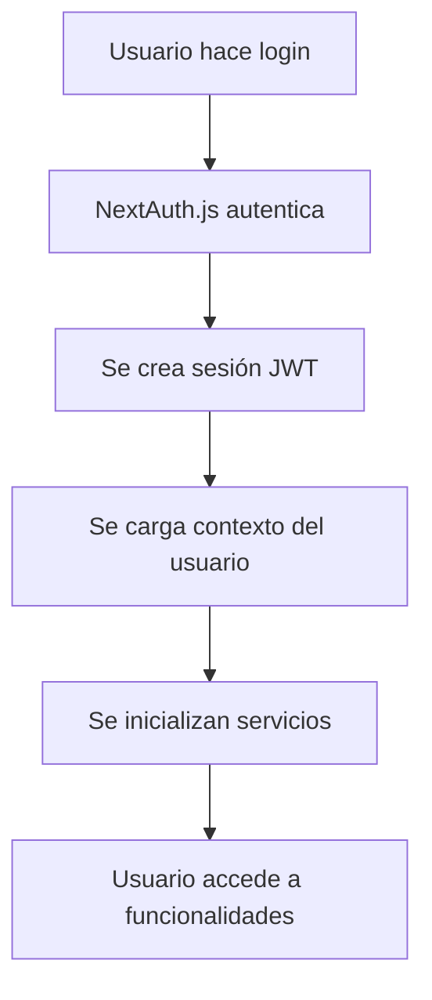
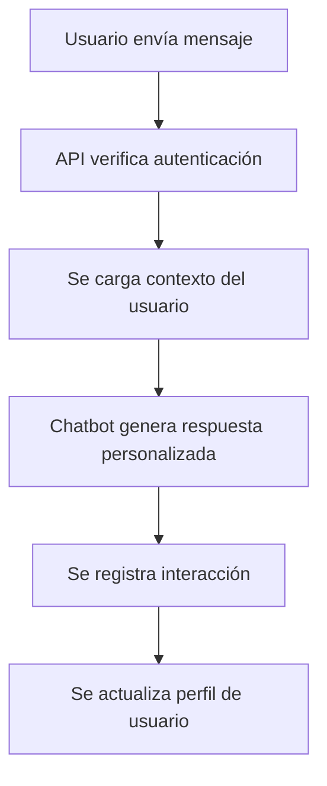
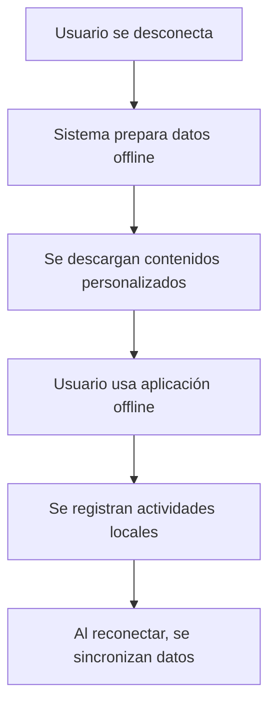

# 🔐 Integración Completa de Autenticación - InclusiveAI Coach

## 📋 Resumen

Este documento describe la integración completa del sistema de autenticación con todas las funcionalidades del proyecto InclusiveAI Coach, incluyendo chatbot, detección de necesidades especiales, reconocimiento de voz, sincronización offline, monitoreo de actividad y más.

## 🏗️ Arquitectura de Integración

### Componentes Principales

1. **Sistema de Autenticación** (`lib/auth.ts`)
2. **Middleware de Autenticación** (`lib/middleware/auth-middleware.ts`)
3. **Hook de Autenticación** (`lib/hooks/useAuth.ts`)
4. **Componente de Protección de Rutas** (`components/auth/ProtectedRoute.tsx`)
5. **Sistema de Monitoreo** (`lib/monitoring/user-activity-tracker.ts`)
6. **Sistema de Sincronización** (`lib/sync/user-sync-manager.ts`)

## 🔗 Integraciones Implementadas

### 1. Chatbot Inteligente

**Archivo**: `lib/ai-services/chatbot-service.ts`

**Integración**:
- ✅ Carga contexto del usuario autenticado
- ✅ Adapta respuestas según preferencias del usuario
- ✅ Considera necesidades especiales del usuario
- ✅ Personaliza sugerencias según historial
- ✅ Registra interacciones para análisis

**Funcionalidades**:
```typescript
// Cargar contexto del usuario
await chatbotService.loadUserContext(userId);

// Actualizar contexto con preferencias
await chatbotService.updateContext({
  userPreferences: {
    language: user.language,
    culturalBackground: user.culturalBackground,
    accessibility: user.accessibilityPreferences,
    specialNeeds: user.specialNeeds
  }
});
```

### 2. Detección de Necesidades Especiales

**Archivo**: `lib/ai-services/needs-detection-service.ts`

**Integración**:
- ✅ Usa información del usuario autenticado
- ✅ Considera contexto cultural del usuario
- ✅ Adapta análisis según preferencias de accesibilidad
- ✅ Guarda resultados asociados al usuario
- ✅ Proporciona recomendaciones personalizadas

**Funcionalidades**:
```typescript
// Análisis personalizado basado en usuario
const analysis = await needsDetectionService.analyzeNeeds(
  user.id, 
  interactionData
);

// Considerar contexto cultural
const culturalContext = user.culturalBackground || 'general';
```

### 3. Reconocimiento de Voz

**Archivo**: `lib/ai-services/speech-recognition-service.ts`

**Integración**:
- ✅ Configura idioma según preferencias del usuario
- ✅ Adapta comandos según necesidades especiales
- ✅ Considera contexto cultural
- ✅ Registra uso para personalización

**Funcionalidades**:
```typescript
// Configurar usuario autenticado
speechService.setUserContext(userId, {
  language: user.language,
  culturalContext: user.culturalBackground,
  accessibility: user.accessibilityPreferences
});
```

### 4. Sincronización Offline

**Archivo**: `lib/sync/user-sync-manager.ts`

**Integración**:
- ✅ Prepara contenido offline personalizado
- ✅ Sincroniza datos específicos del usuario
- ✅ Resuelve conflictos de datos
- ✅ Mantiene integridad de datos
- ✅ Registra actividad de sincronización

**Funcionalidades**:
```typescript
// Preparar datos offline personalizados
const offlineData = await userSyncManager.prepareOfflineData(user);

// Sincronizar datos del usuario
const syncResult = await userSyncManager.syncUserData(user, localData);
```

### 5. Monitoreo de Actividad

**Archivo**: `lib/monitoring/user-activity-tracker.ts`

**Integración**:
- ✅ Registra todas las actividades del usuario
- ✅ Genera estadísticas personalizadas
- ✅ Proporciona recomendaciones basadas en actividad
- ✅ Monitorea uso de características de accesibilidad
- ✅ Rastrea sesiones de aprendizaje

**Funcionalidades**:
```typescript
// Registrar actividad
await userActivityTracker.trackActivity({
  userId: user.id,
  action: 'lesson_completed',
  page: '/lessons/math',
  timestamp: new Date(),
  metadata: { lessonId: 'math-1', score: 85 }
});

// Obtener estadísticas personalizadas
const stats = await userActivityTracker.getUserStats(user.id);
```

### 6. APIs Protegidas

**Archivos**: `app/api/ai/chatbot/route.ts`, `app/api/ai/needs-detection/route.ts`

**Integración**:
- ✅ Verificación de autenticación en todas las APIs
- ✅ Uso de middleware de autenticación
- ✅ Contexto del usuario en todas las operaciones
- ✅ Logging de actividad para auditoría

**Funcionalidades**:
```typescript
// Middleware de autenticación
export const POST = requireAuth(async (request, user) => {
  // API protegida con contexto del usuario
  const result = await processWithUserContext(user);
  return NextResponse.json(result);
});
```

## 🔒 Seguridad Implementada

### 1. Autenticación Multi-Provider

- ✅ **Credenciales** (email/password)
- ✅ **Google OAuth**
- ✅ **Facebook OAuth**
- ✅ **Sesiones JWT seguras**
- ✅ **Hash de contraseñas con bcrypt**

### 2. Protección de Rutas

- ✅ **Middleware de autenticación**
- ✅ **Componente ProtectedRoute**
- ✅ **Verificación de roles**
- ✅ **Redirección automática**

### 3. Validación de Datos

- ✅ **Sanitización de entrada**
- ✅ **Validación con Zod**
- ✅ **Rate limiting**
- ✅ **Headers de seguridad**

### 4. Auditoría y Logging

- ✅ **Registro de actividades**
- ✅ **Logs de seguridad**
- ✅ **Auditoría de acceso**
- ✅ **Monitoreo de anomalías**

## 📊 Flujo de Datos Integrado

### 1. Login del Usuario



### 2. Interacción con Chatbot



### 3. Sincronización Offline



## 🎯 Personalización por Usuario

### 1. Preferencias de Idioma

- ✅ **Idioma principal del usuario**
- ✅ **Contenido adaptado culturalmente**
- ✅ **Interfaz en idioma preferido**
- ✅ **Chatbot en idioma del usuario**

### 2. Necesidades de Accesibilidad

- ✅ **Preferencias de accesibilidad**
- ✅ **Herramientas adaptativas**
- ✅ **Comandos de voz personalizados**
- ✅ **Interfaz adaptada**

### 3. Contexto Cultural

- ✅ **Fondo cultural del usuario**
- ✅ **Contenido culturalmente relevante**
- ✅ **Ejemplos contextualizados**
- ✅ **Adaptación de materiales**

### 4. Estilo de Aprendizaje

- ✅ **Perfil de aprendizaje detectado**
- ✅ **Contenido adaptado al estilo**
- ✅ **Recomendaciones personalizadas**
- ✅ **Progreso individualizado**

## 🔧 Configuración y Uso

### 1. Variables de Entorno Requeridas

```bash
# Autenticación
NEXTAUTH_SECRET="your-secret"
NEXTAUTH_URL="http://localhost:3000"

# Proveedores sociales
GOOGLE_CLIENT_ID="your-google-client-id"
GOOGLE_CLIENT_SECRET="your-google-client-secret"
FACEBOOK_CLIENT_ID="your-facebook-client-id"
FACEBOOK_CLIENT_SECRET="your-facebook-client-secret"

# Servicios de IA
ANTHROPIC_API_KEY="your-anthropic-key"
OPENAI_API_KEY="your-openai-key"
```

### 2. Uso en Componentes

```typescript
// Hook de autenticación
const { user, login, logout, status } = useAuth();

// Protección de rutas
<ProtectedRoute requiredRole="STUDENT">
  <Dashboard />
</ProtectedRoute>

// Contexto del usuario en servicios
const chatbotService = getChatbotService();
await chatbotService.loadUserContext(user.id);
```

### 3. APIs Protegidas

```typescript
// Middleware de autenticación
export const POST = requireAuth(async (request, user) => {
  // Tu lógica aquí con contexto del usuario
  const result = await processRequest(request, user);
  return NextResponse.json(result);
});
```

## 📈 Métricas y Monitoreo

### 1. Métricas de Usuario

- ✅ **Tiempo de sesión**
- ✅ **Lecciones completadas**
- ✅ **Puntuación promedio**
- ✅ **Uso de características**

### 2. Métricas de Accesibilidad

- ✅ **Uso de herramientas de accesibilidad**
- ✅ **Preferencias de usuario**
- ✅ **Efectividad de adaptaciones**
- ✅ **Satisfacción del usuario**

### 3. Métricas de IA

- ✅ **Interacciones con chatbot**
- ✅ **Detección de necesidades**
- ✅ **Precisión de recomendaciones**
- ✅ **Adaptación cultural**

## 🚀 Próximos Pasos

### 1. Mejoras Planificadas

- [ ] **Autenticación biométrica**
- [ ] **Multi-factor authentication**
- [ ] **Sesiones persistentes**
- [ ] **Análisis avanzado de comportamiento**

### 2. Optimizaciones

- [ ] **Cache de contexto de usuario**
- [ ] **Sincronización en tiempo real**
- [ ] **Compresión de datos offline**
- [ ] **Análisis predictivo**

### 3. Nuevas Integraciones

- [ ] **Integración con LMS externos**
- [ ] **APIs de terceros**
- [ ] **Sistemas de evaluación**
- [ ] **Plataformas educativas**

## 🔍 Troubleshooting

### Problemas Comunes

1. **Error de autenticación**
   - Verificar variables de entorno
   - Comprobar configuración de proveedores
   - Revisar logs de NextAuth

2. **Contexto no cargado**
   - Verificar conexión a base de datos
   - Comprobar permisos de usuario
   - Revisar logs de servicios

3. **Sincronización fallida**
   - Verificar conectividad
   - Comprobar conflictos de datos
   - Revisar logs de sincronización

### Logs de Debug

```bash
# Habilitar logs detallados
DEBUG=next-auth:*
DEBUG=inclusive-ai:*
npm run dev
```

## 📚 Referencias

- [NextAuth.js Documentation](https://next-auth.js.org/)
- [Prisma Documentation](https://www.prisma.io/docs/)
- [Anthropic API Documentation](https://docs.anthropic.com/)
- [OpenAI API Documentation](https://platform.openai.com/docs/)

---

**Nota**: Esta integración proporciona una experiencia completamente personalizada y segura para cada usuario, manteniendo la accesibilidad y adaptabilidad como principios fundamentales.
