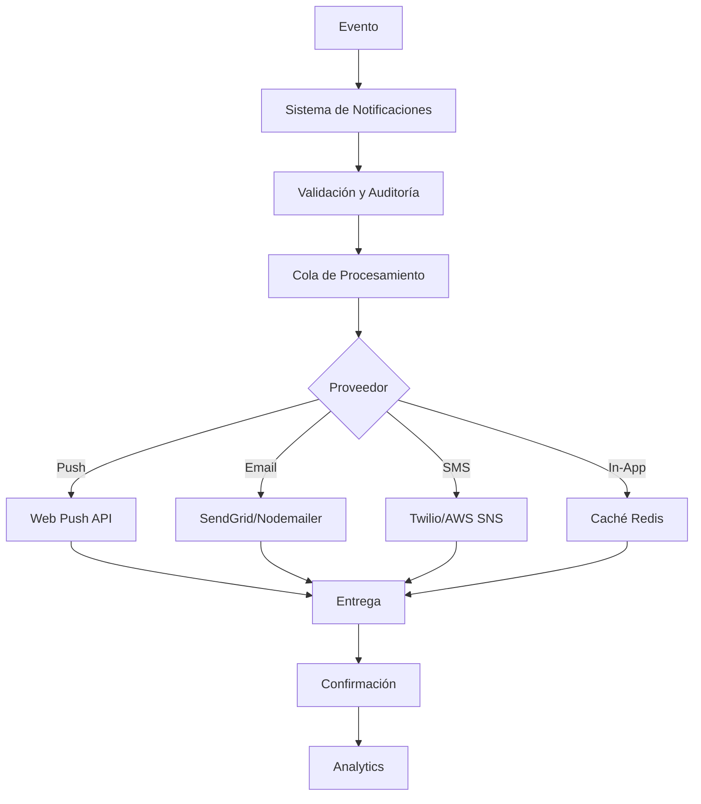

# Sistema de Notificaciones - InclusiveAI Coach

## Resumen

El sistema de notificaciones de InclusiveAI Coach proporciona una solución completa y accesible para enviar notificaciones a través de múltiples canales: push notifications, email, SMS e in-app notifications. El sistema está diseñado para ser culturalmente sensible y accesible para usuarios con diferentes necesidades.

## Características Principales

### 🔔 Tipos de Notificaciones

1. **Push Notifications**
   - Notificaciones del navegador
   - Soporte para diferentes navegadores
   - Acciones personalizables
   - Sonidos y vibración

2. **Email Notifications**
   - Múltiples proveedores (SendGrid, Nodemailer, AWS SES)
   - Templates personalizables
   - Adaptación cultural del contenido
   - Soporte para múltiples idiomas

3. **SMS Notifications**
   - Soporte para zonas rurales
   - Múltiples proveedores (Twilio, AWS SNS, Local)
   - Templates adaptados para SMS
   - Fallback automático

4. **In-App Notifications**
   - Notificaciones dentro de la aplicación
   - Centro de notificaciones accesible
   - Filtros y búsqueda
   - Gestión de estado

### 🌍 Adaptación Cultural

- **Idiomas soportados**: Español, Maya, Nahuatl, Quechua
- **Contextos culturales**: Adaptación automática del contenido
- **Sensibilidad cultural**: Evita contenido inapropiado
- **Ejemplos locales**: Usa referencias culturales relevantes

### ♿ Accesibilidad

- **Screen Reader**: Compatible con lectores de pantalla
- **Navegación por teclado**: Control completo con teclado
- **Alto contraste**: Soporte para temas de alto contraste
- **Texto grande**: Escalado automático del texto
- **Descripción de audio**: Para contenido multimedia

## Arquitectura del Sistema

### Componentes Principales

```
📁 lib/
├── notifications.ts          # Sistema principal
├── redis-cache.ts           # Caché de notificaciones
└── security.ts              # Validación y auditoría

📁 app/api/notifications/
├── route.ts                 # API principal
├── push/
│   ├── route.ts            # API push notifications
│   └── vapid-key/
│       └── route.ts        # Claves VAPID
└── templates/
    └── route.ts            # Gestión de templates

📁 components/ui/
├── notification-center.tsx  # Centro de notificaciones
└── push-notification-subscriber.tsx # Suscripción push

📁 public/
└── service-worker.js       # Service Worker
```

### Flujo de Notificaciones



## Configuración

### Variables de Entorno

```bash
# Push Notifications
VAPID_PUBLIC_KEY="your-vapid-public-key"
VAPID_PRIVATE_KEY="your-vapid-private-key"
PUSH_ENDPOINT="/api/notifications/push"

# Email Notifications
SENDGRID_API_KEY="your-sendgrid-api-key"
FROM_EMAIL="noreply@inclusiveai.com"

# SMS Notifications
TWILIO_ACCOUNT_SID="your-twilio-account-sid"
TWILIO_AUTH_TOKEN="your-twilio-auth-token"
TWILIO_FROM_NUMBER="+1234567890"

# Redis Cache
REDIS_HOST="localhost"
REDIS_PORT="6379"
REDIS_PASSWORD=""
REDIS_DB="0"
```

### Generar Claves VAPID

```bash
# Instalar web-push
npm install -g web-push

# Generar claves
web-push generate-vapid-keys

# Agregar al .env
VAPID_PUBLIC_KEY="generated-public-key"
VAPID_PRIVATE_KEY="generated-private-key"
```

## Uso del Sistema

### Envío de Notificaciones

#### Notificación Simple

```typescript
import { notificationSystem } from '@/lib/notifications';

// Enviar notificación básica
await notificationSystem.sendNotification({
  type: 'push',
  title: 'Nueva lección disponible',
  message: 'Tienes una nueva lección de matemáticas',
  userId: 'user-uuid',
  priority: 'normal',
  category: 'lesson',
  culturalContext: 'maya',
  language: 'maya'
});
```

#### Notificación con Template

```typescript
// Enviar notificación usando template
await notificationSystem.sendTemplateNotification(
  'lesson-reminder',
  'user-uuid',
  {
    lessonTitle: 'Matemáticas Básicas',
    teacherName: 'Maestro Juan'
  },
  {
    type: 'push',
    priority: 'high',
    culturalContext: 'maya',
    language: 'maya'
  }
);
```

#### Notificación Masiva

```typescript
// Enviar a múltiples usuarios
const users = [
  { userId: 'user1', variables: { name: 'Ana' } },
  { userId: 'user2', variables: { name: 'Carlos' } }
];

await notificationSystem.sendBulkNotification(
  'welcome',
  users,
  {
    type: 'email',
    priority: 'normal'
  }
);
```

### Componentes React

#### Centro de Notificaciones

```tsx
import { NotificationCenter } from '@/components/ui/notification-center';

function Dashboard() {
  return (
    <div>
      <NotificationCenter
        userId="user-uuid"
        culturalContext="maya"
        language="maya"
        position="top-right"
        maxNotifications={10}
        showUnreadCount={true}
      />
    </div>
  );
}
```

#### Suscripción a Push Notifications

```tsx
import { PushNotificationSubscriber } from '@/components/ui/push-notification-subscriber';

function Settings() {
  return (
    <div>
      <PushNotificationSubscriber
        userId="user-uuid"
        culturalContext="maya"
        language="maya"
        onSubscriptionChange={(subscribed) => {
          console.log('Estado de suscripción:', subscribed);
        }}
      />
    </div>
  );
}
```

## APIs

### Enviar Notificación

```http
POST /api/notifications
Content-Type: application/json

{
  "action": "send_notification",
  "type": "push",
  "title": "Nueva lección",
  "message": "Tienes una nueva lección disponible",
  "userId": "user-uuid",
  "priority": "normal",
  "category": "lesson",
  "culturalContext": "maya",
  "language": "maya"
}
```

### Obtener Notificaciones

```http
GET /api/notifications?userId=user-uuid&type=push&limit=10&offset=0
```

### Marcar como Leída

```http
PUT /api/notifications?action=mark_read&userId=user-uuid&notificationId=notif-id
```

### Push Notifications

#### Suscribirse

```http
POST /api/notifications/push
Content-Type: application/json

{
  "action": "subscribe",
  "userId": "user-uuid",
  "subscription": {
    "endpoint": "https://fcm.googleapis.com/fcm/send/...",
    "keys": {
      "p256dh": "base64-encoded-key",
      "auth": "base64-encoded-key"
    }
  },
  "culturalContext": "maya",
  "language": "maya"
}
```

#### Enviar Push

```http
POST /api/notifications/push
Content-Type: application/json

{
  "action": "send",
  "userId": "user-uuid",
  "title": "Nueva lección",
  "message": "Tienes una nueva lección disponible",
  "icon": "/icons/lesson-icon.png",
  "data": {
    "type": "lesson",
    "lessonId": "lesson-uuid"
  }
}
```

## Templates de Notificaciones

### Templates Predefinidos

```typescript
const templates = {
  welcome: {
    id: 'welcome',
    name: 'Bienvenida',
    type: 'email',
    title: '¡Bienvenido a InclusiveAI Coach!',
    message: 'Hola {name}, te damos la bienvenida a tu viaje de aprendizaje inclusivo.',
    variables: ['name'],
    culturalAdaptations: {
      'maya': {
        title: '¡Bienvenido a InclusiveAI Coach!',
        message: 'Ba\'ax ka wa\'alik {name}, bienvenido a tu camino de aprendizaje.'
      },
      'nahuatl': {
        title: '¡Bienvenido a InclusiveAI Coach!',
        message: 'Niltze {name}, bienvenido a tu aprendizaje.'
      }
    }
  },
  lessonReminder: {
    id: 'lesson-reminder',
    name: 'Recordatorio de lección',
    type: 'push',
    title: 'Nueva lección disponible',
    message: 'Tienes una nueva lección: {lessonTitle}',
    variables: ['lessonTitle']
  },
  achievement: {
    id: 'achievement',
    name: 'Logro alcanzado',
    type: 'in-app',
    title: '¡Felicitaciones!',
    message: 'Has completado: {achievement}',
    variables: ['achievement']
  }
};
```

### Crear Template Personalizado

```typescript
const customTemplate = {
  id: 'custom-notification',
  name: 'Notificación Personalizada',
  type: 'push',
  title: 'Título personalizado',
  message: 'Mensaje con {variable1} y {variable2}',
  variables: ['variable1', 'variable2'],
  culturalAdaptations: {
    'maya': {
      title: 'Título en Maya',
      message: 'Mensaje en Maya con {variable1}'
    }
  },
  accessibility: {
    screenReader: true,
    highContrast: true,
    largeText: true,
    audioDescription: false
  }
};

// Registrar template
await notificationSystem.registerTemplate(customTemplate);
```

## Monitoreo y Analytics

### Métricas de Notificaciones

```typescript
// Obtener estadísticas
const stats = await notificationSystem.getNotificationStats('user-uuid');

console.log({
  total: stats.total,
  sent: stats.sent,
  delivered: stats.delivered,
  failed: stats.failed,
  byType: stats.byType,
  byCategory: stats.byCategory
});
```

### Logs de Auditoría

```typescript
// Los logs se generan automáticamente
console.log('[SECURITY AUDIT]', {
  id: 'audit-uuid',
  userId: 'user-uuid',
  action: 'notification_sent',
  timestamp: '2024-01-01T00:00:00Z',
  metadata: {
    notificationId: 'notif-uuid',
    type: 'push',
    category: 'lesson'
  }
});
```

## Testing

### Tests Unitarios

```typescript
import { notificationSystem } from '@/lib/notifications';

describe('Notification System', () => {
  test('should send notification', async () => {
    const notificationId = await notificationSystem.sendNotification({
      type: 'in-app',
      title: 'Test',
      message: 'Test message',
      userId: 'test-user'
    });
    
    expect(notificationId).toBeDefined();
  });
});
```

### Tests de Integración

```typescript
describe('Push Notifications', () => {
  test('should subscribe user', async () => {
    const response = await fetch('/api/notifications/push', {
      method: 'POST',
      headers: { 'Content-Type': 'application/json' },
      body: JSON.stringify({
        action: 'subscribe',
        userId: 'test-user',
        subscription: mockSubscription
      })
    });
    
    expect(response.status).toBe(200);
  });
});
```

## Seguridad

### Validación de Datos

- **Sanitización**: Todos los inputs se sanitizan
- **Validación**: Esquemas Zod para validación
- **Auditoría**: Logs de todas las acciones
- **Rate Limiting**: Protección contra spam

### Privacidad

- **Datos mínimos**: Solo se almacenan datos necesarios
- **Encriptación**: Datos sensibles encriptados
- **Retención**: Política de retención configurable
- **GDPR**: Cumplimiento con regulaciones

## Optimización

### Performance

- **Caché**: Redis para almacenamiento rápido
- **Cola**: Procesamiento asíncrono
- **Batching**: Envío en lotes para notificaciones masivas
- **CDN**: Assets optimizados

### Escalabilidad

- **Horizontal**: Múltiples instancias
- **Vertical**: Recursos configurables
- **Load Balancing**: Distribución de carga
- **Monitoring**: Métricas en tiempo real

## Troubleshooting

### Problemas Comunes

#### Push Notifications No Funcionan

1. Verificar claves VAPID
2. Comprobar permisos del navegador
3. Verificar service worker
4. Revisar logs del navegador

#### Email No Se Envía

1. Verificar API key de SendGrid
2. Comprobar configuración SMTP
3. Verificar límites de rate
4. Revisar logs del servidor

#### SMS No Llega

1. Verificar credenciales de Twilio
2. Comprobar número de origen
3. Verificar saldo de cuenta
4. Revisar logs de Twilio

### Debugging

```typescript
// Habilitar logs detallados
process.env.DEBUG = 'inclusive-ai:notifications:*';

// Verificar estado del sistema
const status = notificationSystem.getStatus();
console.log('Estado del sistema:', status);
```

## Roadmap

### Próximas Características

- [ ] Notificaciones programadas
- [ ] Notificaciones basadas en eventos
- [ ] Integración con calendario
- [ ] Notificaciones de voz
- [ ] Soporte para más idiomas indígenas
- [ ] Analytics avanzados
- [ ] A/B testing de notificaciones

### Mejoras Técnicas

- [ ] WebSocket para notificaciones en tiempo real
- [ ] Machine Learning para personalización
- [ ] Integración con más proveedores
- [ ] Optimización de rendimiento
- [ ] Mejoras de accesibilidad

## Contribución

Para contribuir al sistema de notificaciones:

1. Fork el repositorio
2. Crea una rama para tu feature
3. Implementa los cambios
4. Agrega tests
5. Documenta los cambios
6. Envía un pull request

## Soporte

Para soporte técnico:

- **Documentación**: `/docs/NOTIFICATIONS.md`
- **Issues**: GitHub Issues
- **Discord**: Canal #notifications
- **Email**: support@inclusiveai.com

---

**Nota**: Este sistema está diseñado para ser inclusivo y accesible. Todas las características deben mantener estos principios al implementarse.
